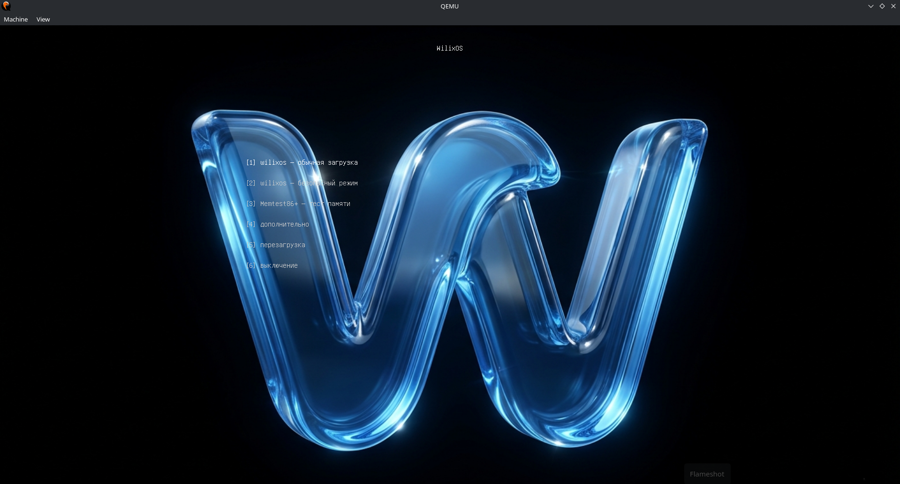
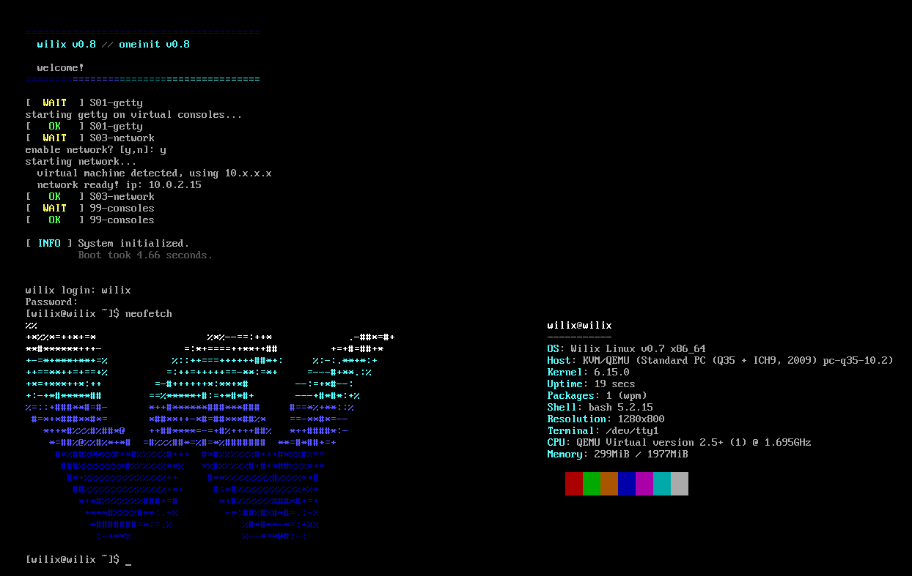

молодежный дистр wilix с ядром 6.15


=============

сборка:

скачайте ядро линукс 6.15 и соберите его с конфигом который приложен в проекте, потом скопируйте скрипты и запустите их, вот примерные команды:

```bash
sudo apt install libncurses-dev  # семейство дебиан и убунту
sudo xbps-install ncurses-devel  # void
sudo pacman -S ncurses           # семейство арч
wget https://cdn.kernel.org/pub/linux/kernel/v6.x/linux-6.15.tar.xz # скачивание ядра
tar -xf linux-6.15.tar.xz # распаковка
cd ~/linux-6.15.325
rm .config # удаляем старый конфиг
cp ~/wilix/.config .
make menuconfig # если надо подредактировать самому
make -j$(nproc) bzImage
file arch/x86/boot/bzImage # собралось?
cd ..
cd initrd/bin
wget https://busybox.net/downloads/binaries/1.36.1-x86_64-linux-musl/busybox
wget https://github.com/robxu9/bash-static/releases/download/5.2.015/bash-linux-x86_64 -O bash
chmod +x busybox && chmod +x bash
cd ~/wilix
git clone https://github.com/SPERMA22814886752/wpm.git
sudo apt install musl-tools # семейство дебиан и убунту
sudo xbps-install cross-x86_64-linux-musl # void
sudo pacman -S musl # семейство арч
x86_64-linux-musl-gcc -static -O2 -std=c99 -D_DEFAULT_SOURCE -o wpm wpm.c
cp wpm ~/initrd/usr/bin
chmod +x grub start
mkdir -p ~/initrd && cp ~/wilix/initrd/ ~/initrd
git clone https://github.com/SPERMA22814886752/oneinit.git
x86_64-linux-musl-gcc -static -O2 -std=c99 -D_DEFAULT_SOURCE -o init oneinit.c   # если хотите максимально маленький размер инита
gcc -static -O2 -o init oneinit.c                                           # обычная сборка
cp init ~/initrd/sbin
./start && ./grub

sudo xbps-install edk2-ovmf # void
sudo apt install ovmf     # семейсто дебиан и убунту
sudo pacman -S edk2-ovmf  # семейство арч

qemu-system-x86_64 \
  -cdrom wilixos-uefi.iso \
  -m 2048 \
  -machine type=q35 \
  -bios /usr/share/edk2/x64/OVMF_CODE.fd \
  -display gtk         # уефи

qemu-system-x86_64 \
  -cdrom wilixos-bios.iso \
  -m 2048
  -machine type=q35 \
  -display gtk          # биос
```
если шота не работает или не собралось пишите в иссуес

=============

устанавливание приложений:

```bash
wpm add nano # текстовый редактор
wpm add nnn # файловый мененджер
wpm --list-packages # лист пакетов
wpm --delete-cache # удалить кэш
wpm update # обновить список
wpm search <query> # искать
```
кидайте статические бинарники в тг @pristochelovek097 для того чтобы я их добавил в репо

=============

скрины:




=============

инфо:

библеотека musl, архитектура x86_64
